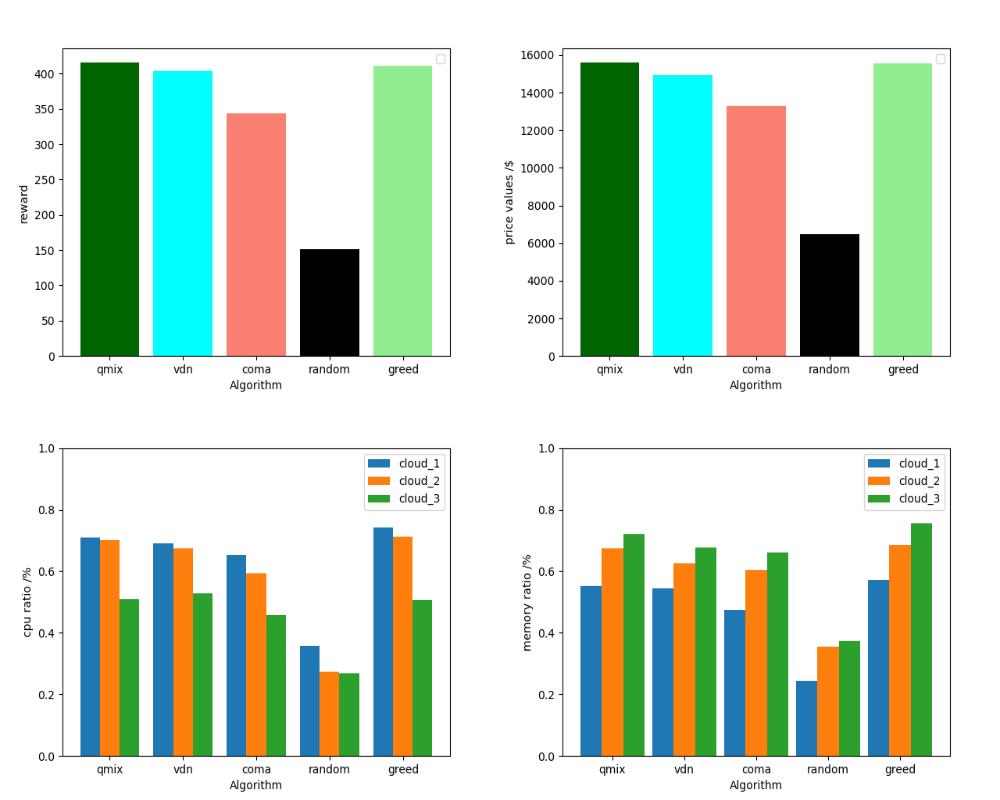
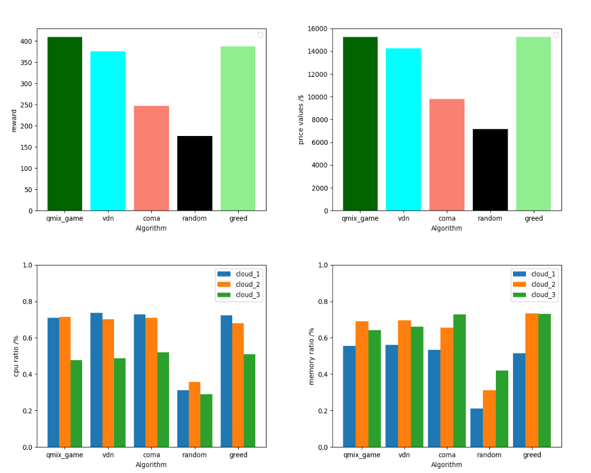

# marl_resource_allocation
**Read this in other languages: [中文](README_zh.md).**

#### introduce
qmix,vnd,coma to allocate resources. Because some Chinese notes may be marked for personal use, please delete them if not necessary after clone.

#### Software architecture

The /agent directory is the agent implementation.

The /common directory is an implementation of common methods such as utils.

The /data directory is the implementation of the experimental data storage location.

The /env directory is the implementation of the environment Settings.

The /generate directory is the implementation of the data enhancement extension.

The /model directory is where the model is saved.

The /network directory is the implementation of the network structure.

The /policy directory is the implementation of the algorithm.

The /requirement directory is an implementation of the user's requirement.

The /result directory is the location where data such as images of experiment results are saved.

#### Installation tutorial

1.  First clone the repository locally
2.  Install dependencies in your home directory according to requirements.txt（There are dependencies that may not be used, such as StarCraft 2's dependencies, even if they are not installed）
3.  You need to modify the parameters in/common/[argument.py](common%2Fargument.py)，Including learning rate, total step size, etc.And then you can run it through [main.py](main.py). 

#### example
Let's take the t=1 moment as an example, where the list of users is shown in Table 1 and the list of servers is shown in Table 2.
When user 1 arrives, the servers in the server list are quoted according to formula 1.2 [p1, p2, p3] = [60,65,57.5].
Here we only use the simple energy consumption formula y=x2+10x, which may be more complicated in practice.
In this round, server v3 wins and is assigned. Then, according to the VCG mechanism,
the final bid of the server P=60. In this round of distribution, the utility of the server u=60-57.5=2.5
, the utility of the user e =75-60=15, and the social welfare w= u + e =17.5.
Then the second user enters, and the server bid [20,20,22.04].
Since v1 and v2 bid the same and user 2 has a large r2 resource proportion,
user 2 is allocated to v2, which also has a large r2 resource proportion. u=2.04, e=2.96, w=5 can be calculated.
By analogy, it can be calculated that the server bids in the following three rounds are [140,155.76, 134.54], [65,74.51,67.525], [52.04,48.1, -1],
where -1 indi-cates that the server resources are not enough to allocate the current request.
In the end, the social welfare distributed by these five users was 111.9.

#### Partial result presentation

1.  Experimental results of different algorithms

2.  Comparison of training process under laziness reward

3.  qmix_game algorithm based on the mechanism (1 million steps training)

#### statement

This code provides support for the paper "Research on online time slot resource allocation mechanism based on multi-agent reinforcement learning". You may not use the code for your own paper submission without permission. Failure to do so will result in accountability.

