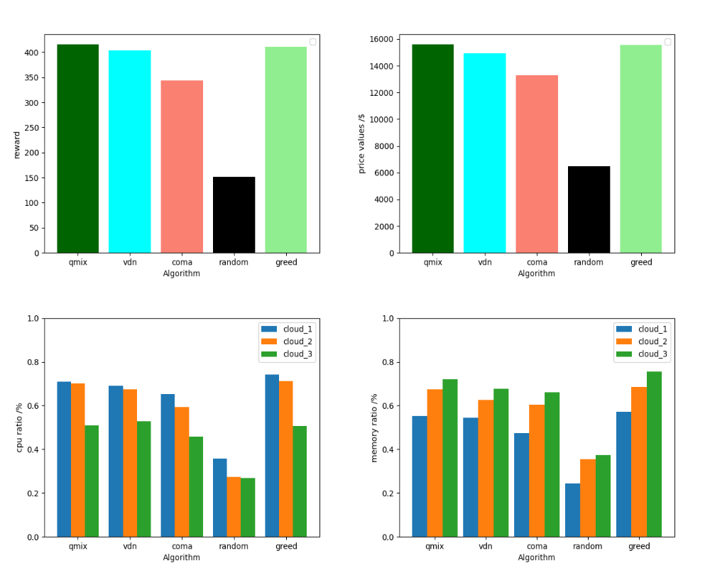
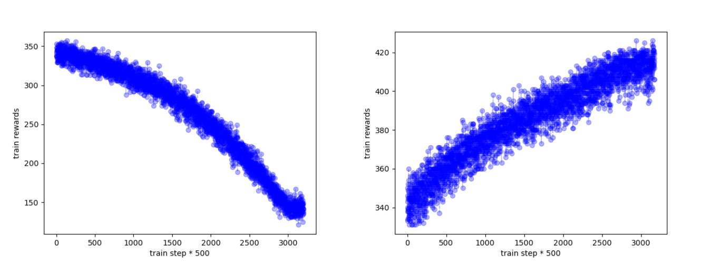
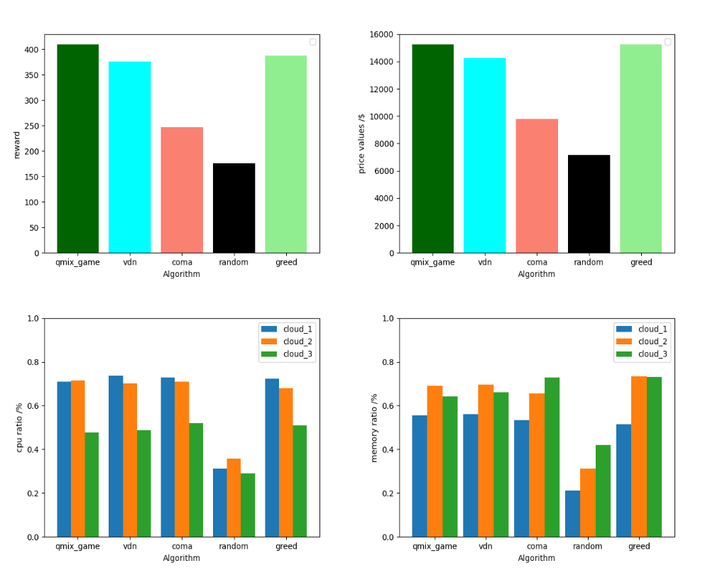

# marl_resource_allocation
**其他语言版本: [English](README.md)**

#### 介绍
qmix,vnd,coma实现资源分配.因为个人需要可能标注了一些供自己使用的中文注释，clone完后如果不需要请自行删除。

#### 软件架构

/agent目录为agent的实现。

/common目录为通常的一些方法比如utils的实现。

/data目录为实验数据存放位置的实现。

/env目录为环境设置的实现。

/generate目录为数据增强扩充方式的实现。

/model目录为模型的保存位置。

/network目录为网络结构的实现。

/policy目录为算法的实现。

/requirement目录为用户需求的实现。

/result目录为实验结果图片等数据保存位置。

#### 安装教程

1.  首先克隆仓库到本地
2.  在主目录下根据requirements.txt安装依赖（依赖中存在可能没有用到的依赖，比如星际争霸2的依赖，没有安装上也没有关系）
3.  你需要在/common/[argument.py](common%2Fargument.py)中修改参数，包括学习率，总步长等。然后就可以通过[main.py](main.py)运行。 

#### 部分结果展示

1.  不同算法实验结果

2.  懒惰奖励下的训练过程对比

3.  基于机制下的qmix_game算法（100万步训练）

#### 声明

该代码为论文“Research on online time slot resource allocation mechanism based on multi-agent reinforcement learning”提供支撑。未经允许不可将代码用于自身论文的投稿。否则将追究责任。

